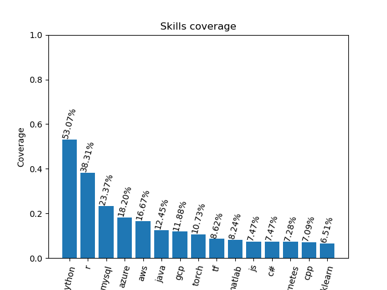

# IT Labor Market Analysis

Over 901 open vacancies from Linkedin were collected and based on those, the research was conducted. The goal was to identify relevent skills in AI job market. 

### What was considered/accounted?

* Vacancies where **at least one of the predefined skills occurrs**. Predefined skills could be found in "settings.json", they were parsed from vacncies by using ChatGPT.
* Job opportunities from Germany, Austria, Switzerland - as they are the point of interest of the author
* Some companies and jobs tended to post "trash jobs", those have nothing to do with ML/AI field, were excluded

On the graph below top 15 desired skills can be observed.

